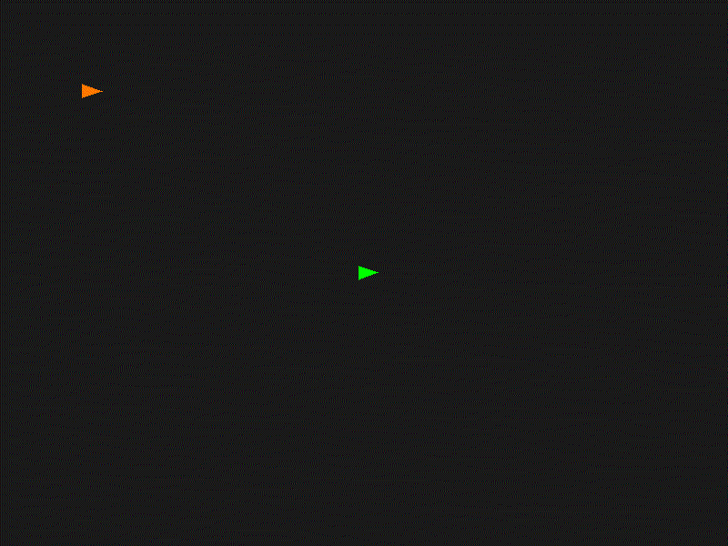

# leader follower

This implementation is a practical approximation of the minimum-energy leader-following controller problem.

Refer the [assignment](Leader-Following_Problem.pdf) for more details about the problem statement.

---

- Green line- Leader trajectory.

- Orange line- Follower trajectory.

- Blue dots- Sampled waypoints.
------------------------------------

The implemented controller approximates the minimum-energy solution for the linearized double-integrator dynamics using smooth cubic polynomial trajectories between sampled waypoints. While the exact Gramian-based optimal control law was not explicitly implemented, cubic trajectories naturally arise as minimum-energy solutions for double-integrator systems under smooth boundary constraints. Therefore, the implemented approach preserves the key concepts of minimum-energy waypoint tracking while remaining computationally correct and stable for simulation.

------
## Physics of the unicycle robot

The unicyclerobot is a nonholonomic system.

That means:

- It cannot instantly move sideways
- It can only move `forward/backward` and `rotate`

------------------------------------

## Robot motion model

The robot state is:
$$X = [x,\; y,\; \theta]$$

Where:

$x,y$ → position,  
$\theta$ → heading/orientation

The motion equations are:

$$
\dot{x} = v\cos\theta
$$

$$
\dot{y} = v\sin\theta
$$

$$
\dot{\theta} = \omega
$$

### Position update

If robot faces angle $\theta$:

- $x$ motion is:
$v\cos\theta$
- $y$ motion is:
$v\sin\theta$
- Orientation update
$\omega$ controls turning rate.

positive → left turn, negative → right turn

-------------------------------------
### working: 

The leader has constant forward speed ($v$)  
and constant angular velocity ($\omega$), which produces circular/curved motion.

#### Why the leader LOOKS random

Because in implementation I added:
`leader_step_with_bounds()`
This is NOT part of the assignment dynamics.

But, an artificial wall bouncing to keep robot inside screen.
So actual behavior becomes Circular motion with sudden reflections at walls, 
apparently random trajectory.

- Here, the terms $\cos\theta,\sin\theta$ make the system nonlinear.

### For nonlinear systems:

- optimal control is hard
- exact minimum-energy solution is difficult

So we use:
- Feedback Linearization

### Feedback Linearization Idea

Define the new state:

$$
\mathbf{z} =
\begin{bmatrix}
x \\
\dot{x} \\
y \\
\dot{y}
\end{bmatrix}
$$

where

$$
\dot{x} = v\cos\theta
$$

$$
\dot{y} = v\sin\theta
$$

### New Dynamics

Choose inputs such that:

$$
\ddot{x} = u_1
$$

$$
\ddot{y} = u_2
$$

Then the system dynamics become:
 
$$\frac{d}{dt} \begin{bmatrix} x \\ \dot{x} \\ y \\ \dot{y} \end{bmatrix} = \begin{bmatrix} \dot{x} \\ u_1 \\ \dot{y} \\ u_2 \end{bmatrix}$$

or equivalently:

$$
\dot{\mathbf{z}} = A\mathbf{z} + B\mathbf{u}
$$

with

$$
A =
\begin{bmatrix}
0 & 1 & 0 & 0 \\
0 & 0 & 0 & 0 \\
0 & 0 & 0 & 1 \\
0 & 0 & 0 & 0
\end{bmatrix}
$$

$$
B =
\begin{bmatrix}
0 & 0 \\
1 & 0 \\
0 & 0 \\
0 & 1
\end{bmatrix}
$$

---

This transformed system is:

- linear
- controllable
- suitable for optimal control methods such as LQR and MPC.

### Physical interpretation

Instead of controlling wheel motion directly, we control accelerations in $x$ and $y$ directions.

---

### Minimum energy control idea

we want the follower to move from current state to target state using minimum control effort.

### Cost Function

$$
J =
\int_{0}^{T}
\mathbf{u}^\top \mathbf{u}\, dt
$$

where

$$
\mathbf{u} =
\begin{bmatrix}
u_1 \\
u_2
\end{bmatrix}
$$

---

### Meaning

The objective is to:

$$
\min J
$$

which minimizes the total control effort (energy) over the time horizon.

Equivalently, the controller seeks the smoothest trajectory requiring the least actuator input.

This avoids:

- jerky motion
- aggressive acceleration
- unstable oscillation

and gives:

- smooth trajectory
- efficient movement

For a double integrator:

$$
\ddot{x} = u
$$

minimum-energy trajectory becomes a cubic polynomial.

### General cubic form: 
$$
x(t) = a_0 + a_1 t + a_2 t^2 + a_3 t^3
$$

### Boundary Conditions

At the start:

$$
x(0) = x_0
$$

$$
\dot{x}(0) = 0
$$

At the end:

$$
x(T) = x_f
$$

$$
\dot{x}(T) = 0
$$

---

### Solving the Cubic Polynomial

Using

$$
x(t) = a_0 + a_1 t + a_2 t^2 + a_3 t^3
$$

and applying the boundary conditions gives:

$$
x(t) = x_0 + \frac{3(x_f - x_0)}{T^2} t^2 - \frac{2(x_f - x_0)}{T^3} t^3
$$

#### Velocity comes from derivative

Differentiate trajectory:

$$
\dot{x}(t) = 2a_2 t + 3a_3 t^2
$$

This gives smooth velocity.
----

### One-step delayed waypoint tracking

This is the MOST important concept.

At time: 
$$t_{k}$$
follower measures leader state.

But it reaches target at:
$$t_{k+1}$$

#### *Follower is always one step behind*

*"The Follower says: I see where leader was, I will smoothly move there during next interval."*

---

### Orientation control

Our linearized system does *NOT* directly control $\theta$. So how do we orient the robot?	

Velocity direction determines orientation:

$$\theta = \tan^{-1}\left(\frac{\dot{y}}{\dot{x}}\right)$$
Robot points in direction of motion.

### Angular velocity control:
We compute heading error:

$$
\mathit{angle\_error} = \theta_{\text{desired}} - \theta_{\text{current}}
$$

and then apply a Proportional controller (P-controller)

$$
\omega = K_p * \mathit{angle\_error}
$$

If robot heading is wrong, it will turn proportionally toward desired direction

- Large error: strong turning

- Small error: gentle correction

So the controller achieves:

- smooth tracking
- minimum-energy-like behavior
- stable heading
- delayed waypoint following

all without solving complicated optimal-control equations numerically.

### Limitations: 
Follower path lags because: 
- delayed measurements
- finite control time

Other issues are: 
- noisy measurements
- discrete observations

----
## Effect of sampling time($T_s$)
Small sampling time -  Follower gets frequent updates which results in
- accurate tracking
- less lag

Large sampling time - Follower receives stale information:

- more delay
- larger tracking error
- smoother but less accurate motion

## Intuition

The follower behaves like:
- observe the leader periodically.
- generate the smoothest possible path to its previous location.
- orient itself along that path while minimizing control effort.

----

## TODO: 
1. Implement true minimum-energy Gramian controller: 
The current implementation is a practical approximation (feedback linearization) of the minimum-energy controller, but it is not the true optimal controller derived from the controllability Gramian.

### What current implementation does

#### Current Controller Structure

The controller generates trajectories as cubic polynomials:

$$
x(t) = a_0 + a_1 t + a_2 t^2 + a_3 t^3
$$

$$
y(t) = b_0 + b_1 t + b_2 t^2 + b_3 t^3
$$

Velocity commands are obtained from the derivatives:

$$
v_x(t) = \dot{x}(t)
$$

$$
v_y(t) = \dot{y}(t)
$$

The translational velocity magnitude becomes:

$$
v(t) = \sqrt{v_x^2 + v_y^2}
$$

Desired heading is computed as:

$$
\theta_{\text{desired}} = \text{atan2}(v_y,\; v_x)
$$

---

### Physical Interpretation

This means the controller:

- manually constructs a smooth trajectory
- then forces the robot to follow it

This is known as:

$$
\text{Trajectory Generation + Trajectory Tracking}
$$

---

### Important Observation

The controller does **not** explicitly solve the optimal control problem:

$$
\min_{\mathbf{u}}
\int_0^T
\mathbf{u}^\top \mathbf{u}\, dt
$$

Instead, it assumes the cubic trajectory is already smooth and suitable.

---

### Why Cubic Trajectories Work Well

For systems approximated as double integrators:

$$
\ddot{x} = u_x
$$

$$
\ddot{y} = u_y
$$

cubic polynomials naturally resemble minimum-energy trajectories under boundary constraints.

Therefore the method is:

- physically meaningful
- smooth
- stable
- computationally inexpensive

but not strictly mathematically optimal
--------

## True Minimum-Energy Controller

---

### Optimal Control Problem

Consider the linear system:

$$
\dot{\mathbf{z}} = A\mathbf{z} + B\mathbf{u}
$$

Given:

$$
\mathbf{z}(0)=\mathbf{z}_0
$$

and desired terminal state:

$$
\mathbf{z}(T)=\mathbf{z}_T
$$

find the control input:

$$
\mathbf{u}(t)
$$

that minimizes the energy cost:

$$
\boxed{J = \int_0^T \mathbf{u}^\top \mathbf{u}\,dt}
$$

---

### Exact Minimum-Energy Solution

Optimal control theory gives the minimum-energy input:

$$
\boxed{\mathbf{u}(t) = B^\top e^{A^\top(T-t)} W^{-1}(T) \left(\mathbf{z}_T - e^{AT}\mathbf{z}_0\right)}
$$

This is the exact minimum-energy controller.

---

### Controllability Gramian

The matrix

$$
\boxed{W(T) = \int_0^T e^{A\tau} BB^\top e^{A^\top\tau} \,d\tau}
$$

is called the:

$$
\text{Controllability Gramian}
$$

---

### Physical Meaning of the Gramian

The Gramian measures:

$$
\text{how easily the system can move in different directions}
$$

### Interpretation

Small Gramian:

$$
W(T) \;\text{small}
\quad\Rightarrow\quad
\text{hard to control}
$$

Large energy required.

Large Gramian:

$$
W(T) \;\text{large}
\quad\Rightarrow\quad
\text{easy to control}
$$

Small energy required.

---

### Conceptual Difference

In the current Implementation, trajectory is chosen manually:

$$
x(t),\,y(t)
$$

Then controls are computed to track it.

This is:

$$
\text{Trajectory Generation + Tracking}
$$

---

### True Minimum-Energy Control

The controller itself computes:

- optimal trajectory
- optimal control input
- minimum-energy motion

directly from system dynamics.

---

### Current Controller

The control law is essentially:

$$
\omega = k\,(\theta_{\text{desired}}-\theta)
$$

with

$$
v = v_{\text{desired}}
$$

This behaves like a PD-style trajectory tracker.

So your controller solves:

$$
\text{trajectory tracking}
$$

not:

$$
\text{optimal control}
$$

#### Key Mathematical Difference

##### Current Method

Trajectory first:

$$
x(t),\,y(t) \quad\Rightarrow\quad u(t)
$$

---

###### True Minimum-Energy Method

Control first:

$$
u(t) \quad\Rightarrow\quad x(t),\,y(t)
$$

The trajectory emerges automatically from the optimal input.
---

### Why Cubic Trajectories Work Well

For double-integrator systems:

$$
\ddot{x}=u_x
$$

$$
\ddot{y}=u_y
$$

minimum-energy trajectories naturally become cubic polynomials under boundary constraints.

Therefore cubic trajectories are often:

- smooth
- physically realistic
- close to optimal

even without explicitly solving the optimal-control problem.

Cubic trajectory generation demonstrates understanding of:

- smooth motion generation
- delayed waypoint tracking
- nonlinear-to-linear reasoning
- trajectory optimization concepts

without requiring full optimal-control machinery.
---

#### Current Controller

Very inexpensive computationally:

- polynomial evaluation
- simple arithmetic
- angle tracking

---

#### Gramian-Based Optimal Controller

Requires:

- matrix exponentials
- matrix inversion
- numerical integration

such as:

$$
e^{At}
$$

and

$$
W^{-1}(T)
$$

at every control cycle.

---

####  Difference in Control Outputs
Current Controller Outputs Velocity commands:

$$
v,\;\omega
$$

True Minimum-Energy Controller Outputs

Optimal accelerations:

$$
u_x,\;u_y
$$

which are then integrated:

$$
u \rightarrow \dot{x},\dot{y} \rightarrow x,y
$$

---

#### Boundary Condition Flexibility

cubic controller implicitly assumes:

$$
\dot{x}(0)=0,
\qquad
\dot{x}(T)=0
$$

and similarly for $\dot{y}$.

---

The optimal controller can handle arbitrary:

- initial velocity
- final velocity
- state constraints
- terminal conditions

while still minimizing energy.

---

## Conclusion: 
#### Why the Gramian Matters in Multi-Agent Systems

In large-scale systems:

- multiple agents
- heterogeneous dynamics
- distributed communication

simple cubic trajectories become insufficient.

Such systems require:

$$
\text{full optimal-control machinery}
$$

including:

- controllability analysis
- Gramian-based energy optimization
- distributed optimal control